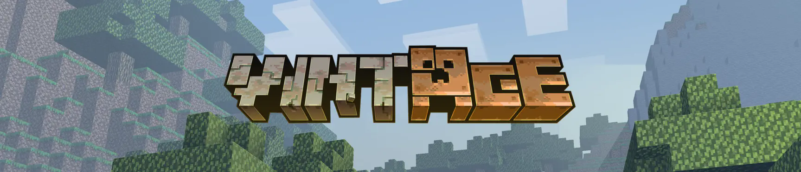

# Elsewhen

*Formerly Story Mode Clouds.*

A NeoForge 1.21.1 client mod after the cosy indie Minecraft of the early years, grown up along its own road:
Story Mode style clouds and the light, haze and sounds around them; an inner voice that thinks at quiet moments
and remembers your worlds, friends and old tools; styled chat and the old consoles' menu sounds.

In **0.8.1**, the memory/research/experiment prototype is on the shelf while its direction is reconsidered.
Its screen, N key, settings and notifications are absent. Existing notes and photographs are retained,
unchanged and without forgetting. The ordinary inner voice and its nostalgia remain.

## Recipe discovery

JEI and EMI reveal recipes through familiar ingredients and stations, or after crafting an item. Small
recipes need every distinct ingredient; recipes with four or more need half by default. Discovery is
independent of notes and creates no notifications. It is on by default; to show everything, turn off
**Nostalgia → Recipe discovery** in settings (K).

Progress is separate for each world and player. Existing discoveries are read from the old
`config/storymodeclouds-memory/` file; new progress uses `config/storymodeclouds-recipes/` without changing
personal records. Keep the old folder if you want to return to the prototype later.

## The interface: Vintage

Enable **Interface → Mods' Screens in the Pack's Look** to apply your active resource pack's textures to
supported mod panels, slots and buttons, including Create buttons. Panel grain and slot interiors keep
their texture scale. The setting is off by default and has a per-mod exclusion list.

Elsewhen is played with **Vintage** (“Classic Minecraft Repainted”) by **RedPierrePacks**. Vintage is a
separate resource pack: its textures and sounds are its authors' work and are not included or redistributed
here. Get it from [Planet Minecraft](https://www.planetminecraft.com/texture-pack/vanilla-mix-w-i-p-preview)
or [Modrinth](https://modrinth.com/resourcepack/vintage). Other compatible active packs work too.

## Install

Minecraft **1.21.1**, NeoForge **21.1.0 or newer**, Java **21**; built against **21.1.256**. Client only;
any server will take you. Download **one** `elsewhen-0.8.1.jar` from the
[latest release](https://github.com/4EEZE/story-mode-clouds-releases/releases/latest), replace the old
Elsewhen/Story Mode Clouds JAR in `mods`, and keep only one copy.

The release also carries the identical `storymodeclouds-0.8.1.jar` for older automatic updaters;
**do not install both**. The mod ID and `config/storymodeclouds-client.toml` keep their original names,
so settings and saved discoveries remain compatible. New versions are offered on the title screen.

## Documentation

- [Changelog](CHANGELOG.md): current changes and previous releases.
- [Pack instructions](docs/resource-packs.md): recipe stations, interface textures, voice lines and biome colours.
- [Archived wiki](archive/wiki-0.8.0/Home.md): the previous prototype documentation, kept for reference.
- Found a bug? Open an [issue](https://github.com/4EEZE/story-mode-clouds-releases/issues).

The 0.8.1 clean build, migration checks and shader checks pass. Minecraft was not launched for this
release; recipe viewers and pack styling still need an in-game check after updating.

The mod is vibecoded: written by LLMs, directed and tested in game by its author.
